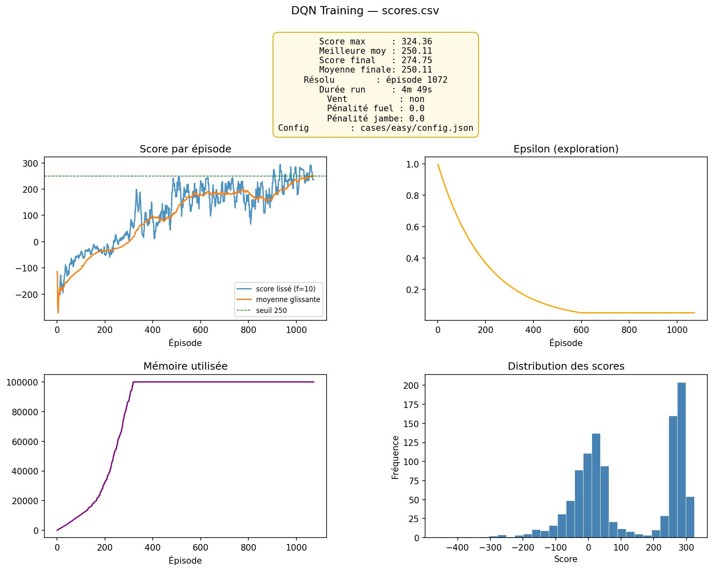

# Multi-Agent Deep RL — LunarLander

Agent **Dueling Double DQN** entraîné sur `LunarLander-v3` (Gymnasium / Box2D), avec scénarios paramétrables (vent, tempête, économie de carburant, mode difficile), pipeline d'entraînement reproductible et générateur de rapports analytiques.

Le dépôt inclut également plusieurs études comparatives sur d'autres environnements classiques de Gymnasium — `CartPole-v1`, `MountainCar-v0`, `Acrobot-v1`, `Ant-v5`, `Taxi-v3` — ainsi qu'une baseline **PPO**.

<p align="center">
  
</p>

---

## Sommaire

- [Aperçu](#aperçu)
- [Installation](#installation)
- [Démarrage rapide](#démarrage-rapide)
- [Configuration](#configuration)
- [Scénarios fournis](#scénarios-fournis)
- [Architecture de l'agent](#architecture-de-lagent)
- [Expériences complémentaires](#expériences-complémentaires)
- [Structure du dépôt](#structure-du-dépôt)
- [Sorties générées](#sorties-générées)
- [Licence](#licence)

---

## Aperçu

L'objectif est d'entraîner un agent à poser un module lunaire sur une plateforme cible sous contraintes physiques variables. L'agent reçoit en entrée un vecteur d'état continu à 8 dimensions (position, vitesse, angle, vitesses angulaires, contact des deux pieds) et choisit parmi 4 actions discrètes (rien, moteur gauche, moteur principal, moteur droit).

Le critère de réussite est une **moyenne glissante de 250 points sur 100 épisodes consécutifs**. Une fois atteint, le modèle est sauvegardé et un rapport graphique est généré automatiquement.

Algorithmes et techniques utilisés :

- **Dueling DQN** — séparation explicite de la valeur d'état `V(s)` et de l'avantage `A(s, a)`.
- **Double DQN** — sélection de l'action via le réseau en ligne, évaluation via le réseau cible.
- **Replay buffer** — mémoire circulaire de transitions échantillonnées uniformément.
- **Soft target updates** — mise à jour exponentielle du réseau cible avec un coefficient `τ`.
- **Exploration ε-greedy** avec décroissance multiplicative.
- **Récompenses augmentées** — pénalités optionnelles de carburant et de moteurs au sol.
- **Perte de Huber** (`smooth_l1_loss`) et **gradient clipping** à 1.0.

---

## Installation

### Prérequis

- Python 3.10 ou supérieur
- Linux, macOS ou Windows (WSL recommandé)
- CUDA 12.1 facultatif — détecté automatiquement, sinon repli sur CPU

### Mise en place

```bash
git clone <url-du-depot>
cd multi-agent-deep-rl

python -m venv .venv
source .venv/bin/activate        # Windows : .venv\Scripts\activate

pip install -r requirements.txt
```

Le fichier [requirements.txt](requirements.txt) inclut l'index `https://download.pytorch.org/whl/cu121` pour récupérer une build PyTorch CUDA si une GPU NVIDIA est disponible. Sur CPU uniquement, `pip` retombe sur la roue standard.

---

## Démarrage rapide

### 1. Entraîner un agent

```bash
python simulation.py cases/easy
```

L'argument est le **répertoire d'un scénario** contenant un fichier `config.json`. À chaque épisode, les statistiques sont écrites dans `scores.csv`. Dès que la moyenne cible est atteinte, le modèle est enregistré dans `model.pth` et un rapport visuel `scores.jpg` est produit.

Si aucun argument n'est fourni, le scénario par défaut [cases/config](cases/config) est utilisé.

### 2. Rejouer un modèle entraîné

```bash
python result.py cases/easy
```

Charge `cases/easy/model.pth` et lance 5 épisodes en rendu graphique (`render_mode="human"`).

### 3. Régénérer un rapport à partir d'un CSV existant

```bash
python viewer.py cases/easy/scores.csv --smooth 20
```

Options :

| Option | Description | Défaut |
|---|---|---|
| `--smooth N` | Fenêtre de lissage de la courbe de score | `10` |
| `--runtime S` | Durée totale d'entraînement en secondes (annotation) | `None` |

---

## Configuration

Chaque scénario est défini par un unique fichier `config.json`. Les hyperparamètres sont regroupés en quatre blocs.

### Bloc `training`

| Clé | Type | Rôle |
|---|---|---|
| `gamma` | float | Facteur d'actualisation des récompenses futures |
| `learning_rate` | float | Taux d'apprentissage de l'optimiseur Adam |
| `memory_size` | int | Capacité du replay buffer |
| `batch_size` | int | Taille d'un mini-batch d'entraînement |
| `train_every` | int | Nombre de pas entre deux mises à jour du réseau |
| `tau` | float | Coefficient de soft update du réseau cible |

### Bloc `epsilon`

| Clé | Type | Rôle |
|---|---|---|
| `start` | float | Valeur initiale d'epsilon |
| `end` | float | Valeur minimale d'epsilon |
| `decay` | float | Facteur multiplicatif appliqué après chaque épisode |

### Bloc `logging`

| Clé | Type | Rôle |
|---|---|---|
| `print_every` | int | Fréquence d'affichage des statistiques (en épisodes) |
| `moy_target` | float | Score moyen visé pour déclarer la tâche résolue |
| `moy_size` | int | Taille de la fenêtre glissante de la moyenne |
| `max_rep` | int | Borne supérieure du nombre d'épisodes |

### Bloc `lander`

| Clé | Type | Rôle |
|---|---|---|
| `fuel_penalty` | float | Pénalité par pas pour toute action non nulle |
| `leg_engine_penalty` | float | Pénalité quand un moteur est utilisé alors qu'un pied touche le sol |
| `enable_wind` | bool | Active la simulation du vent |
| `wind_power` | float | Force du vent (recommandé : `0.0` à `20.0`) |
| `turbulence_power` | float | Intensité des turbulences (recommandé : `0.0` à `2.0`) |

> Les clés `_doc` éventuellement présentes dans les fichiers sont des annotations descriptives ignorées par le chargeur.

---

## Scénarios fournis

Six scénarios prêts à entraîner sont disponibles dans [cases/](cases/).

| Scénario | Vent (`power` / `turbulence`) | Pénalité carburant | Pénalité jambes | Cible |
|---|:---:|:---:|:---:|:---:|
| [`config`](cases/config) | désactivé | 0.0 | 0.5 | 250 |
| [`easy`](cases/easy) | désactivé | 0.0 | 0.0 | 250 |
| [`fuel_efficient`](cases/fuel_efficient) | désactivé | 0.7 | 1.5 | 250 |
| [`wind`](cases/wind) | 15.0 / 1.5 | 0.0 | 0.0 | 250 |
| [`storm`](cases/storm) | 20.0 / 2.0 | 0.0 | 0.0 | 250 |
| [`hard`](cases/hard) | 15.0 / 1.5 | 0.3 | 1.0 | 250 |

Chaque dossier contient au minimum `config.json` et, après entraînement, `scores.csv`, `model.pth` et `scores.jpg`.

---

## Architecture de l'agent

### Réseau Dueling DQN

```text
Entrée (8) ─► Linear(256) ─► ReLU
            ─► Linear(256) ─► ReLU
            ─► Linear(128) ─► ReLU ─┬─► Linear(1)        : V(s)
                                    └─► Linear(4)        : A(s, a)

Q(s, a) = V(s) + (A(s, a) - mean_a A(s, a))
```

Cette décomposition permet au réseau d'apprendre séparément la valeur d'un état et l'avantage relatif des actions, ce qui accélère la convergence quand plusieurs actions ont des effets similaires.

### Boucle d'entraînement

À chaque pas de simulation :

1. L'agent choisit une action via une politique **ε-greedy** sur les Q-valeurs du réseau en ligne.
2. La transition `(s, a, r, s′, done)` est insérée dans le replay buffer.
3. Tous les `train_every` pas, un mini-batch est échantillonné et une mise à jour est effectuée :
   - cible Double DQN : `r + γ · Q_target(s′, argmax_a Q_online(s′, a)) · (1 − done)` ;
   - perte de Huber entre `Q_online(s, a)` et la cible ;
   - clipping de la norme du gradient à 1.0 ;
   - soft update du réseau cible : `θ_target ← τ · θ_online + (1 − τ) · θ_target`.
4. Epsilon décroît à la fin de chaque épisode : `ε ← max(ε_end, ε · ε_decay)`.

L'entraînement s'arrête dès que la moyenne sur les `moy_size` derniers épisodes dépasse `moy_target`, ou que `max_rep` épisodes ont été joués.

### Récompenses augmentées

En complément du signal natif de Gymnasium, deux pénalités optionnelles peuvent être activées via le bloc `lander` du fichier de configuration :

- **`fuel_penalty`** — déduit une valeur fixe à chaque pas où un moteur est utilisé. Encourage des trajectoires économes.
- **`leg_engine_penalty`** — déduit une valeur fixe lorsqu'un moteur est utilisé alors qu'au moins un pied touche déjà le sol (cf. `state[6]` et `state[7]`). Décourage les rebonds après contact.

---

## Expériences complémentaires

Le dépôt regroupe plusieurs études parallèles, chacune autonome dans son répertoire.

| Répertoire | Environnement | Algorithme | Notes |
|---|---|---|---|
| [`test_cartPole`](test_cartPole) | `CartPole-v1` | DQN | Tâche d'équilibrage, espace d'observation continu |
| [`test_mountainCar`](test_mountainCar) | `MountainCar-v0` | DQN | Récompense très clairsemée, exploration cruciale |
| [`test_acrobot`](test_acrobot) | `Acrobot-v1` | DQN | Double pendule sous-actionné |
| [`test_ant`](test_ant) | `Ant-v5` | DQN adapté | MuJoCo, locomotion 3D |
| [`test_taxi`](test_taxi) | `Taxi-v3` | DQN sur encodage one-hot | Comparé à une baseline aléatoire |
| [`test_PPO`](test_PPO) | `LunarLander-v3` | PPO clippé | Acteur-critique, GAE, normalisation des observations |

Chaque sous-répertoire contient un `test.md` (ou `README.md`) détaillant l'architecture, les hyperparamètres et les résultats observés.

---

## Structure du dépôt

```
.
├── agent.py              Réseau Dueling DQN, replay buffer, classe Agent et Config
├── simulation.py         Boucle d'entraînement principale
├── result.py             Rejeu visuel d'un modèle entraîné
├── viewer.py             Génération du rapport graphique à partir d'un CSV
├── requirements.txt      Dépendances Python (avec index PyTorch CUDA 12.1)
├── cases/                Scénarios LunarLander (config + artefacts d'entraînement)
│   ├── config/
│   ├── easy/
│   ├── fuel_efficient/
│   ├── hard/
│   ├── storm/
│   └── wind/
├── config/               Configurations annexes (autres environnements)
├── result/               Sortie agrégée
└── test_*/               Études complémentaires (CartPole, MountainCar, Acrobot, Ant, Taxi, PPO)
```

---

## Sorties générées

Pour un scénario `cases/<nom>`, un entraînement complet produit :

| Fichier | Contenu |
|---|---|
| `scores.csv` | Journal épisode par épisode : score, moyenne, epsilon, taille mémoire |
| `model.pth` | Poids du réseau Dueling DQN à la résolution |
| `scores.jpg` | Rapport graphique : courbe de score, epsilon, mémoire, distribution |

Les fichiers `*.pth` et `*.csv` sont ignorés par défaut (cf. [.gitignore](.gitignore)) — seuls les rapports `scores.jpg` peuvent être versionnés à des fins de comparaison.

---

## Licence

Projet académique réalisé dans le cadre d'un cursus Epitech. Le code est fourni à des fins pédagogiques. Toute réutilisation devra créditer les auteurs.
